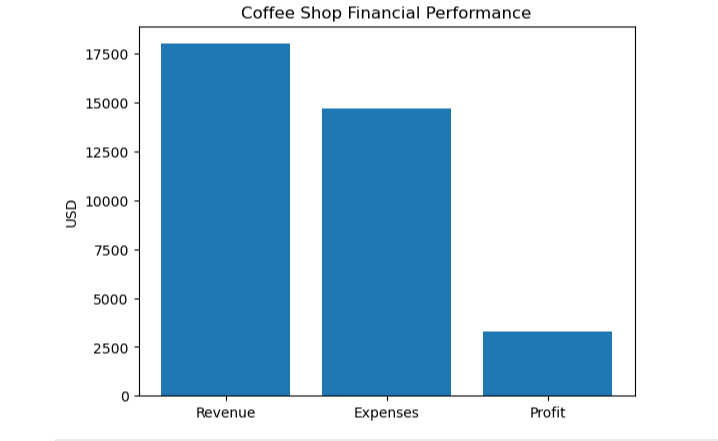

# Coffee Shop Profitability Model

This project builds a financial model for a small coffee shop using Python.

## Objective
Estimate revenue, expenses, profit margins, and break-even points.

## Business Assumptions
- Coffee price: $5
- Customers per day: 120
- Days open per month: 30

## Results
- Monthly Revenue: $18,000
- Monthly Expenses: $14,700
- Monthly Profit: $3,300
- Break-even customers per day: ~98

## Tools Used
- Python
- Jupyter Notebook
- Matplotlib

## Financial Performance Visualization

The visualization shows that the coffee shop generates strong revenue relative to its operating costs, resulting in a monthly profit of approximately $3,300.
